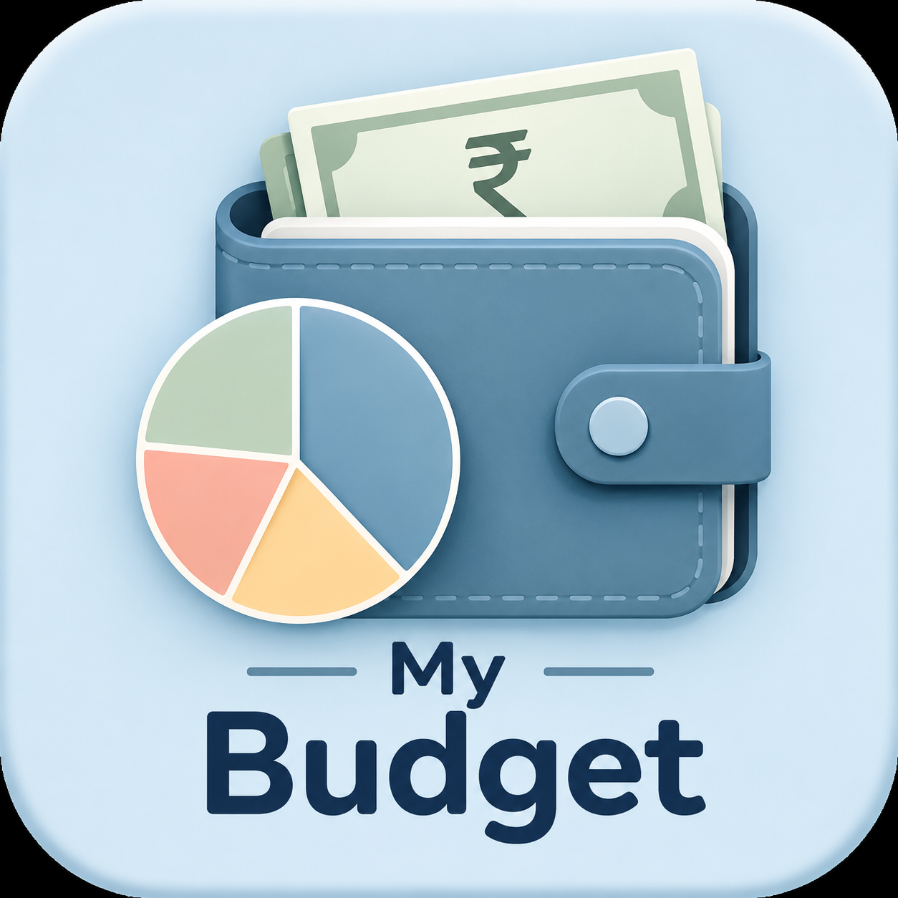

# 💙 My Budget

### A pastel-blue personal budget tracker to manage monthly expenses easily

 

---

## 🔗 App Link & Installation

🚀 **Open My Budget App:**  
https://regal-moonbeam-4f6bff.netlify.app/

📱 **Install on Phone**

1. Open the above link in **Chrome**
2. Tap the **⋮ menu**
3. Select **Install App / Add to Home Screen**
4. Launch it like a normal mobile app ✨

---

## ✨ About

**My Budget** is a simple mobile-style expense tracker that helps you control monthly spending.

Set budgets, add expenses, and instantly see how much money is remaining in every category.

---

## 🚀 Features

✔️ Monthly category budget management  
✔️ Create / Edit / Delete categories  
✔️ Daily expense tracking  
✔️ Expense history records  
✔️ Automatic remaining balance calculation  
✔️ Spending progress bars  
✔️ Over-budget warning  
✔️ ₹ INR currency support  
✔️ Saves data using LocalStorage  
✔️ Works offline after installation  

---

## 🛠 Tech Stack

- HTML
- CSS
- JavaScript
- LocalStorage
- PWA

---

Made with 💙 by **Sidra Shaikh**

